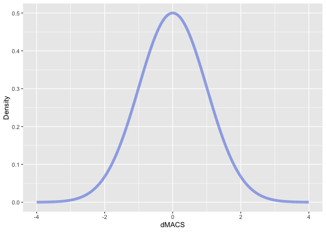

Portfolio 7
================
Conor Lacey
2023-04-13

``` r
suppressWarnings(library(tidyverse))
```

    ## ── Attaching core tidyverse packages ──────────────────────── tidyverse 2.0.0 ──
    ## ✔ dplyr     1.1.0     ✔ readr     2.1.4
    ## ✔ forcats   1.0.0     ✔ stringr   1.5.0
    ## ✔ ggplot2   3.4.1     ✔ tibble    3.2.1
    ## ✔ lubridate 1.9.2     ✔ tidyr     1.3.0
    ## ✔ purrr     1.0.1     
    ## ── Conflicts ────────────────────────────────────────── tidyverse_conflicts() ──
    ## ✖ dplyr::filter() masks stats::filter()
    ## ✖ dplyr::lag()    masks stats::lag()
    ## ℹ Use the ]8;;http://conflicted.r-lib.org/conflicted package]8;; to force all conflicts to become errors

### Introduction

In this portfolio I am going to be trying out gganimate! In presenting
for SAM I felt it would be helpful to animate some Bayesian concepts.
More specifically I hope to animate how prior information updates your
posterior distribution so as to get closer to the truth.

### gganimate Libraries

First let’s load the appropriate libraries

``` r
library(gganimate)
```

    ## Warning: package 'gganimate' was built under R version 4.1.2

``` r
library(transformr)
```

    ## Warning: package 'transformr' was built under R version 4.1.2

gganimate is the primary package that will make it user friendly to code
a moving graph, however I also need to the transformr package because
this allows for interpolation between data points (i.e., this will make
the graph movement smooth)

### Normal Distribution

Now let’s make normal distribution centered at 0 and with an SD of 1.

``` r
x <- seq(-4,4, length.out = 1e4)
y <- dnorm(x, mean = 0, sd = 1)
dat <- tibble(x = x, y = y)

dat %>% ggplot(aes(x = x, y = y)) +
  geom_line(alpha=0.5, linewidth = 2, color = "#4169E1") +
  labs(title = "Normal Distribution",
       y = "Density")
```

<!-- -->

We should also make the normal distribution that we would like the
previous above distribution to shift to.

``` r
x <- seq(-4,4, length.out = 1e4)
y <- dnorm(x, mean = 2, sd = .5)
dat <- tibble(x = x, y = y)

dat %>% ggplot(aes(x = x, y = y)) +
  geom_line(alpha=0.5, linewidth = 2, color = "#4169E1") +
  labs(title = "Normal Distribution",
       y = "Density")
```

<!-- -->

### gganimate (A rookie mistake)

Alright well now this should be simple right? Let’s just code these two
graphs so that there is a transition between the two using gganimate.

``` r
prior <- tibble(x = seq(-4,4, length.out = 1e4),
                y = dnorm(x, mean = 0, sd = 1),
                group =1)

post <-  tibble(x = seq(-4,4, length.out = 1e4),
                y = dnorm(x, mean = 2, sd = .5),
                group =2)

prior_post <- bind_rows(prior,post)

prior_post %>% ggplot(aes(x=x, y=y)) + 
  geom_line(alpha=0.5, linewidth = 2, color = "#4169E1") +
  #Animation
  labs (x = "dMACS",
        y = "Density") + 
  transition_time(group) + 
  ease_aes('linear')
```

<!-- -->

Well this isn’t quite what we are looking for… I mean yes, it’s changing
from the prior to the posterior distribution, but it’s not shifting.

The root of the problem comes from the group variable. Yes, these
distributions are different types and hence should be put in different
groups. However, the way gganimate works is that it is using this
grouping variable as its indicator for what frames to shift between. If
we only have two frames, then it’s going to shift between these two
groups directly, which won’t look very smooth. Therefore, to make this
smoother we need more frames or groups of normal distributions that are
incrementally increasing to a mean of 2 and decreasing to a sd of 0.5.
To simplify the coding of this further I will now call the group
variable frames.

### gganimate (The eliquent way)

``` r
a <- seq(0, 2, length = 100)
b <- seq(1, .5, length = 100)
```

The a and b vectors will specify how we want the distribution to
incrementally change.

Now let’s create a for loop to create these distributions frame by
frame. We will make it so that there are 100 frames of normal
distributions that are increasing from a mean of 0 to a mean 2 and
decreasing from a sd of 1 to an sd of 0.5.

``` r
prior_post<- tibble(x = 0, y = 0, frame = 0)
for (i in 1:100){
x<-seq(-4,4, length.out = 1e4)
y<-dnorm(x, a[i], b[i])
y<-y/max(y)*(.5)
dat <- tibble(x = x, y = y, frame = i)
prior_post <- bind_rows(prior_post, dat)
}
prior_post <- prior_post[-1,]
```

Lastly, let’s animate it!

``` r
prior_post %>% ggplot(aes(x=x, y=y)) + 
  geom_line(alpha=0.5, linewidth = 2, color = "#4169E1") +
  #Animation
  labs (x = "dMACS",
        y = "Density") + 
  transition_time(frame) + 
  ease_aes('linear')
```

<!-- -->

Nice! This is very smooth. Now how about we add some more information on
this graph. Specifically let’s add a marker for where the true value is
in the population as well as the percent of prior knowledge to represent
how increasing your prior knowledge gets to you closer to the truth.

``` r
prior_post %>% ggplot(aes(x=x, y=y)) + 
  geom_line(alpha=0.5, linewidth = 2, color = "#4169E1") +
  geom_vline(xintercept = 2) +
    annotate("text", x = 2, y = -.06, label = "True Value") +
  coord_cartesian(ylim = c(0,.5), clip = "off") +
  #Animation
  labs (title = "Amount of Prior Knowledge = {frame_time}%",
   #     subtitle ="                                                                                                True Value",
        x = "dMACS",
        y = "Density") + 
  
  transition_time(frame) + 
  ease_aes('linear')
```

<!-- -->

And there we have it!
